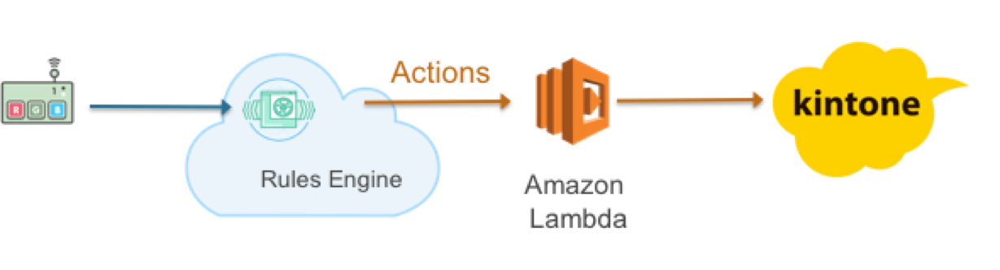

=======================
イントロダクション
=======================

ハンズオンシナリオ
==================

**シナリオ: センサーデータの送信**

Ginga BLEペリフェラルから、IoT GWを通して、AWS IoTのトピックに温度センサーのデータを送信し、AWS IoTでルールに基づきkintoneへの保存を行います。また、しきい値を下回った場合、E-mailでアラートを送信するようにルールを設定します。本ハンズオンにより、センサーからのデータ取得および時系列データの保存、しきい値に対するアクションの手順を確認することができます。

|           

利用するデバイス、アプリケーション、サービス
============================================

**GINGA BLE ペリフェラル**

ネビラボ社が提供するBLEセンサーです。本ハンズオンではセンサーからのデータ取得、AWS IoTへのデータ送信に利用します。
    http://nebulab.co.jp/products/sensornet.html

    ペリフェラルには、温度センサー、湿度センサー、加速度センサーが実装されてます。
    今回のハンズオンでは、温度センサーと湿度センサーを定期的（10秒間隔）にアップロードされます。
    クラウドに上がってくるフォーマットは、以下のとおりです。
    ============= ============================
    key           value
    ============= ============================
    device        デバイス名
    sensor        センサータイプ（temp = 温度、humid = 湿度）
    timestamp     デバイス側タイムスタンプ
    value         センサーの値
    ============= ============================
    
|    

**kintone開発者ライセンス**

ライセンスをお持ちでない方は、30日間無料お試しもしくは開発者ライセンスをお申込みください。
開発者ライセンスは発行に2、3日要しますので、余裕を持ってお申込みください。
    https://cybozudev.zendesk.com/hc/ja/articles/200929540-developer-network-%E3%81%B8%E3%82%88%E3%81%86%E3%81%93%E3%81%9D
    
|    

**AWSアカウント**

AWSコマンドラインでiotおよびiot-dataを実行できるようにご利用のPCの設定をお願いします。
インストールの手順はこちらのとおりです。
    https://aws.amazon.com/jp/register-flow/

|    

**AWS IoT**

接続されたデバイスが安全かつ簡単にクラウドアプリケーションやその他のデバイスとやりとりするためのマネージド型プラットフォームです。本ハンズオンではデバイスからのデータ受信、デバイスのリモート制御などで利用します。
    https://aws.amazon.com/jp/iot/

|    

**Amazon SNS**

Amazon SNSは、モバイルおよびエンタープライズメッセージングの pub-sub サービスで、Mobile Pushやメール、HTTPコールなど複数プロトコルによるメッセージの配信ができます。

    https://aws.amazon.com/jp/sns/

