=================
Amazon SNSの設定
=================

IAMの設定
==============

AWS IoTからSNSを呼び出すためのロールを設定します。
サービス一覧から"IAM"をクリックします。

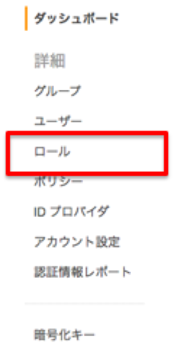

|           

左ペインの"ロール"をクリックします。
右ペインの"新しいロールの作成"をクリックします。

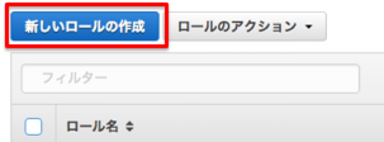

|           

ロール名に"iot_hands_on"を入力し、"次のステップ"をクリックします。

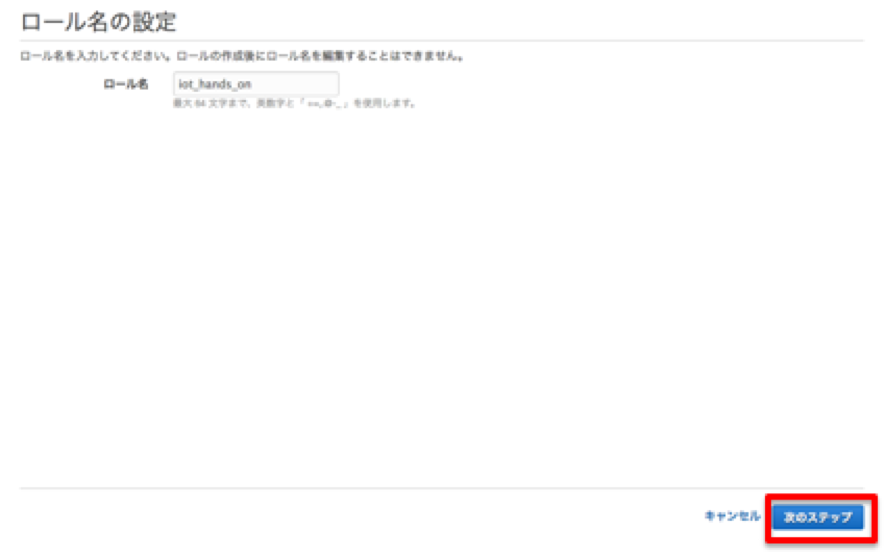

|           

ロールタイプの選択画面で、ロール一覧をスクロールし、AWS IoTの"選択"ボタンをクリックします。

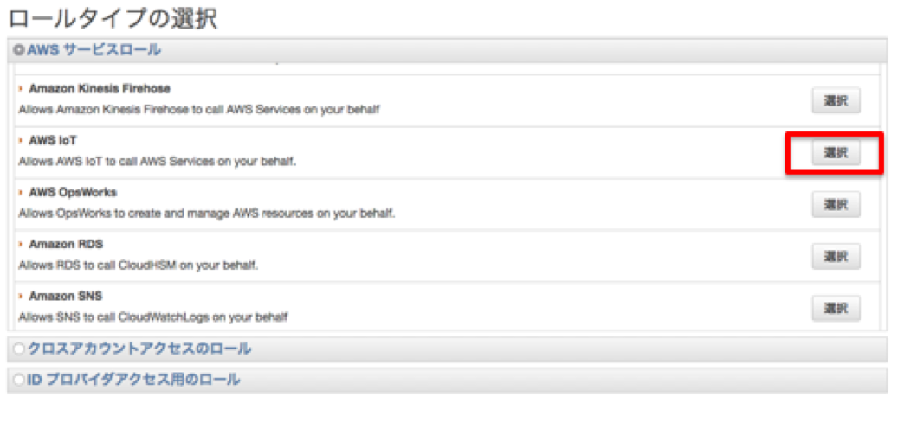

|           

ポリシーのアタッチ画面では、特に選択せず、"次のステップ"をクリックしします。
確認画面で確認し、"ロールの作成"をクリックします。

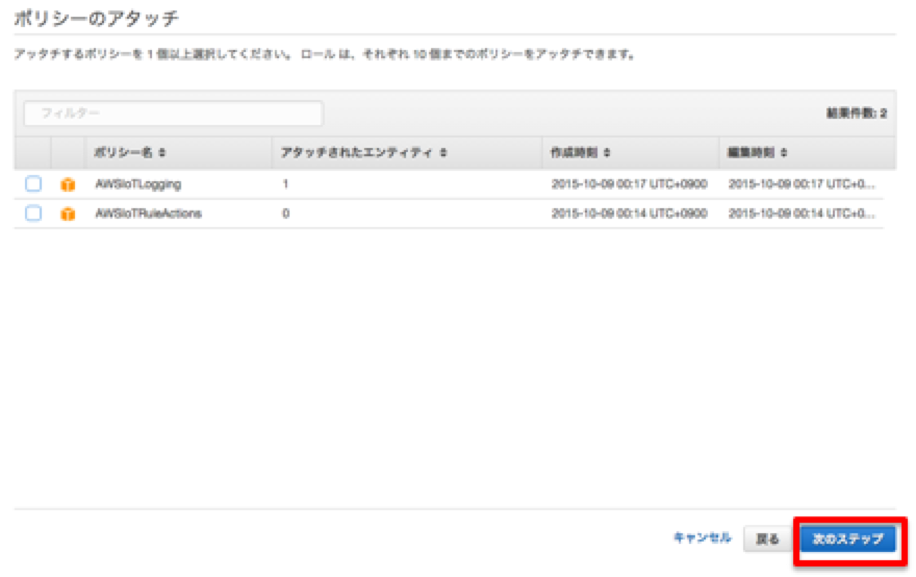

|           

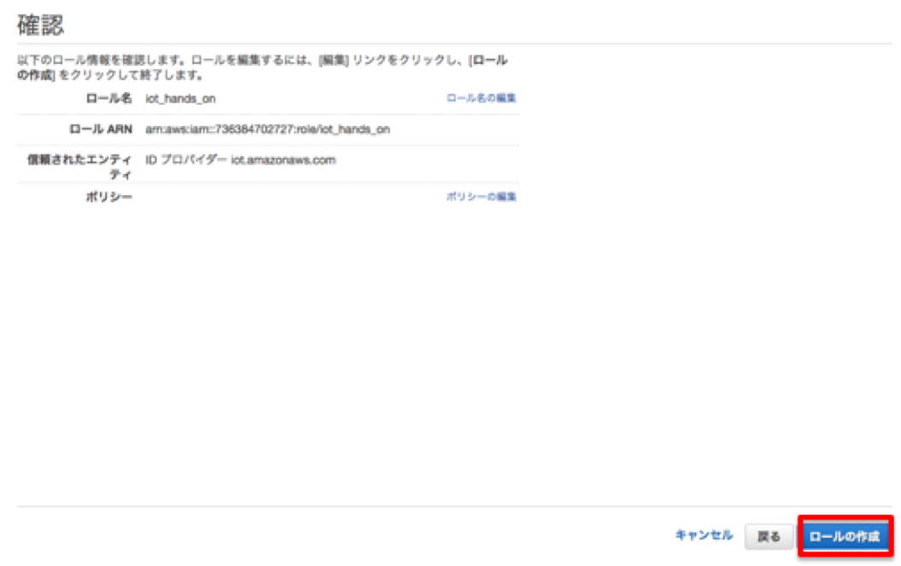

|           

ロールの一覧画面から、先ほど作成したロールを選択します。ロール数が多い方は、検索窓に"iot_"などをいれると絞込ができます。

|           

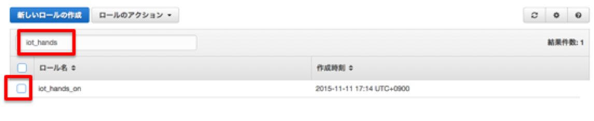

ロールの詳細画面から"ポリシーのアタッチ"をクリックします。

|           

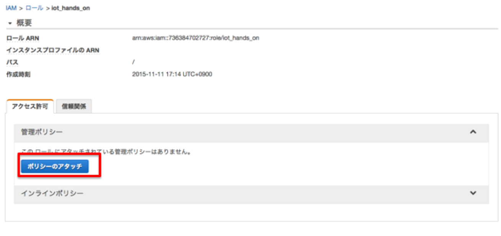

SNSに対するアクセス許可を与えるためにポリシーをアタッチします。ハンズオンでは、SNSのFullAccess権限を付与します。
プロダクションで利用する場合は、細かい権限設定をすることを推奨します。

|           

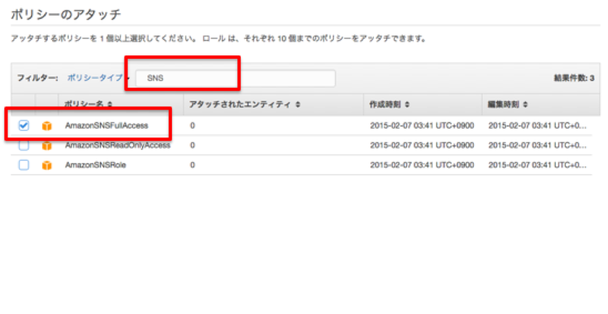

次のハンズオンで、Lambdaの実行を行いますので、ここでLambdaに対する実行権限も付与します。

|           

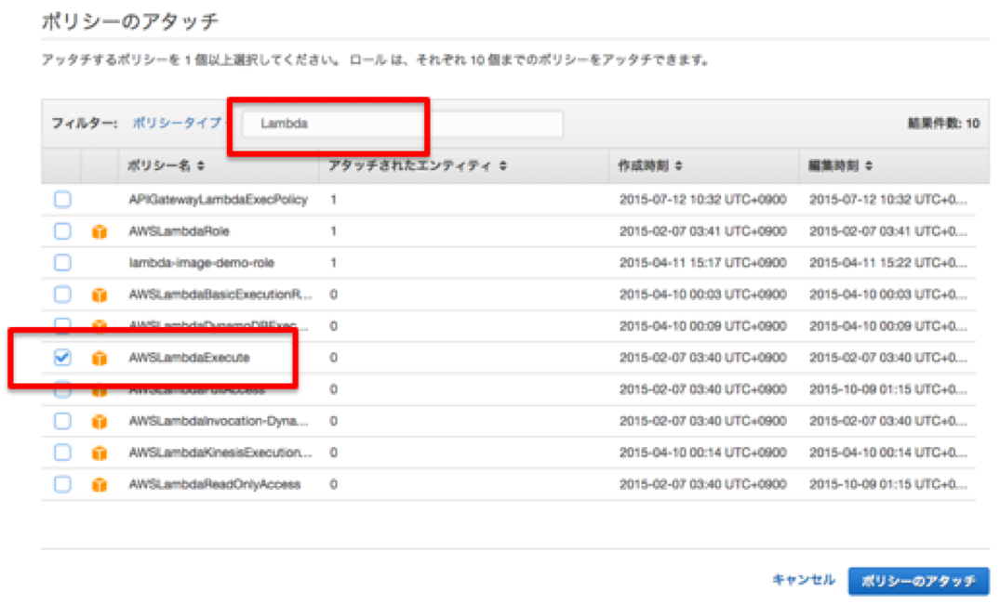

アタッチされていることを確認します。

|           

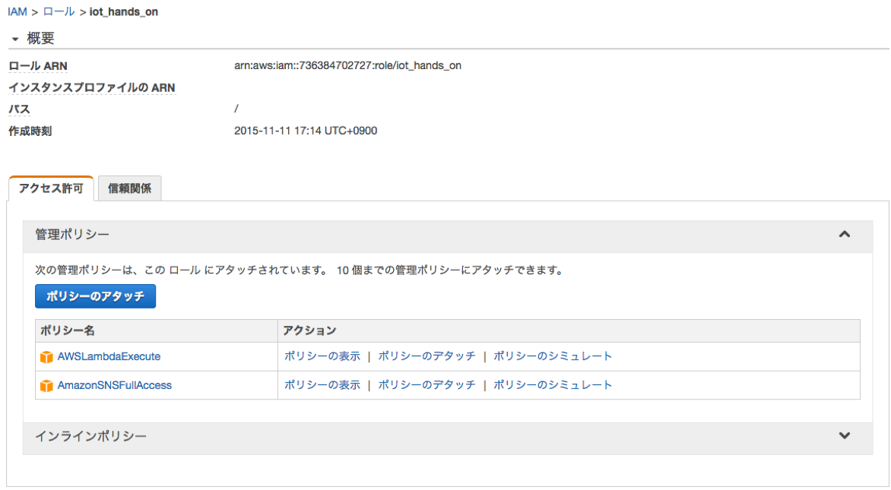

Amazon SNSの設定
==============

Amazon SNSでは、指定したメールにメッセージを転送することができます。
受け付けることができるメールアドレスを準備してください。
携帯電話のメールアドレスで、迷惑メールフィルタをかけている方は注意が必要です。

サービス一覧から"SNS"をクリックします。

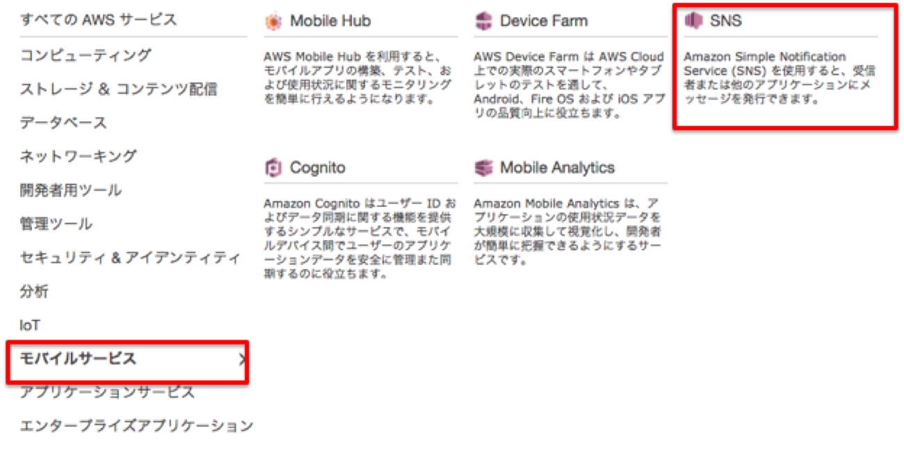

|           

SNS Home画面の中から"Create Topic"を選択します。

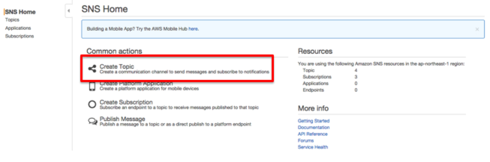

|           

Topic名を入力する画面がポップアップされるので、両方の入力欄に"IoTHandson"を入力してください。
入力後、"Create topic"ボタンをクリックしてください。

|           

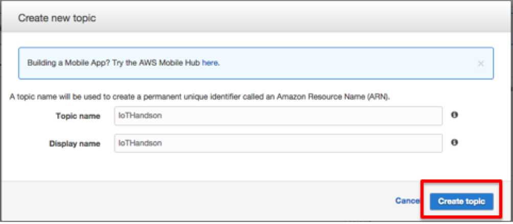

|           

Topic Detailの画面に遷移します。サブスクリプション（今回はご自身のメールアドレス）を設定するので、"Create Subscription"をクリックします。

|           

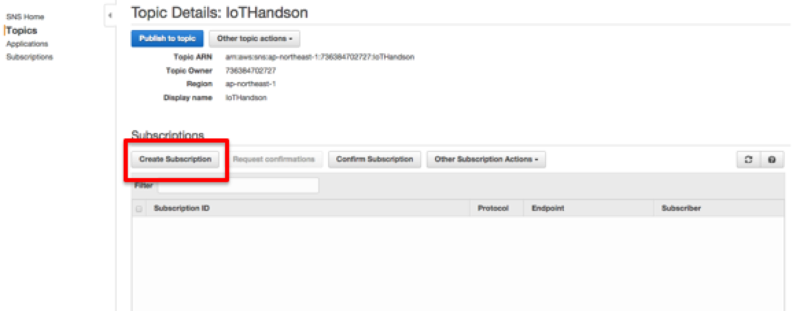

|           

サブスクリプションを設定する画面がポップアップされるので、ProtocolをEmailにして、Endpointにご自身のメールアドレスを入力してください。
入力後、"Create Subscription"ボタンをクリックします。

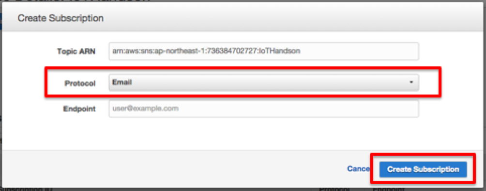

|           

Topic Detailの画面に遷移され、登録したサブスクリプションが"PendingConfirmation"でサブスクリプション一覧にあることを確認します。

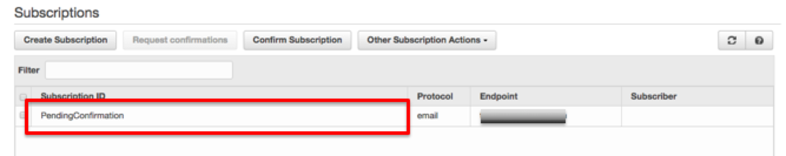

|           

登録したメールアドレスに、確認用のメールがSNSから発信されてますので、メーラーなどで確認してください。
メール本文に、Confirm subscriptionのリンクがありますので、クリックします。

.. image:: images/4-sns-confirm-mail.png

|           

クリックするとブラウザが起動し、Confirmationが完了した画面が表示されます。

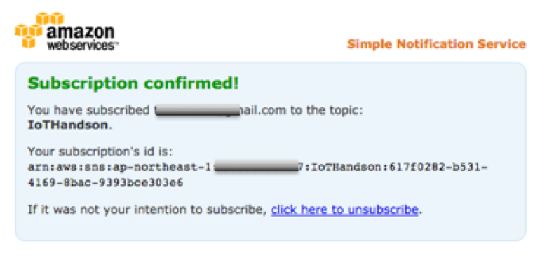

|           

これで登録が完了されました。SNSのTopic Detailの画面に戻り、画面内のリロードボタンをクリックするとサブスクリプション一覧の情報のみ更新されます。
Subscriotion IDが設定されていることを確認してください。

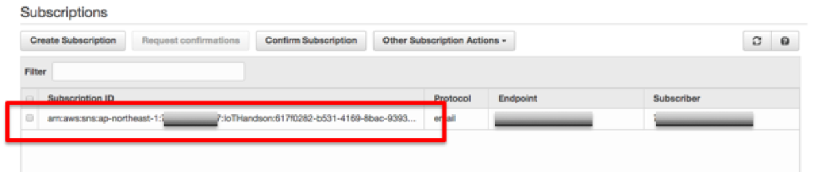

|           

AWS IoTのルール作成
==============

IAMとSNSの設定し、それらの情報をルールとして設定します。
AWS IoTのコンソール画面に遷移し、"create a resource"をクリックします。
作成するリソース一覧から"Create a rule"を選択します。

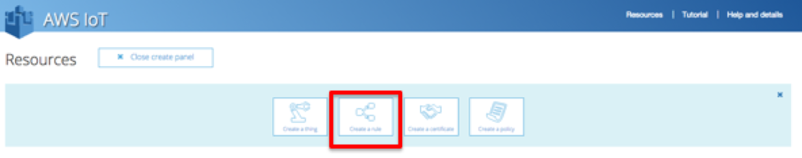

|           

ルール作成画面が表示されますので、各項目に必要事項を入力または選択します。

============= ============================
項目          値
============= ============================
Name          iot_handson_sns
Description   IoT Handson SNS
Attribute     * (アスタリスク)
Topic Filter  {ご自身のデバイスID}/ginga
Condition     sensor = "temp" AND value > 25
============= ============================

Choose an actionでSNSを選択します。

SNS Targetを選択する項目が表示されるので、先ほど作成した、SNS Topic"IoTHandson"を選択します。
選択後、Roleを指定する項目が表示されますので、これも先ほど作成した、ロール"iot_hands_on"を選択します。

この状態で、"Add Action"をクリックします。

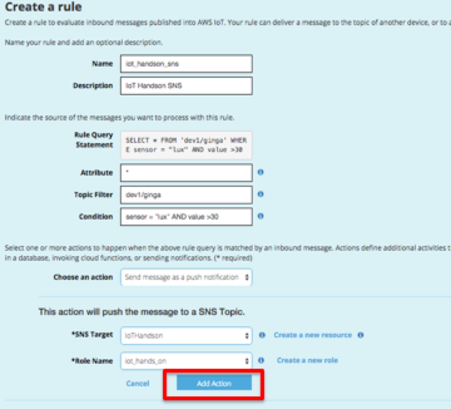

|           

SNSのアイコンが表示されたあと、"Create"ボタンをクリックします。

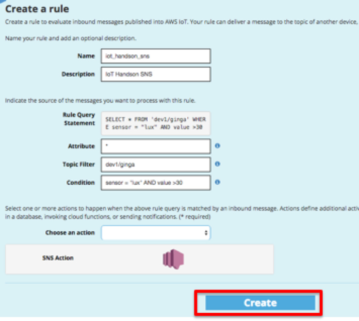

|           

これで、ルール設定は終了です。
Gingaセンサーを手で覆うなどして温度を上げることで、ルールが起動し、メールが発砲されます。
10秒に1回センサーからデータを読み取り、AWS IoTにデータを送信するので、10秒程度おまちください。

ルールのConditionをご自身で操作してみてください。あまりに低い値ですとメールが都度送信されるので注意が必要です。

AWS IoTのルール停止
==============
都度メールが来るとメールボックスが溢れる可能性があるため、ある程度動作確認ができたら、停止いたします。
AWS IoTの画面から作成したルールのチェックボックスをクリックし、ActionsのリストからDisableを選択することで、ルールの起動が停止します。

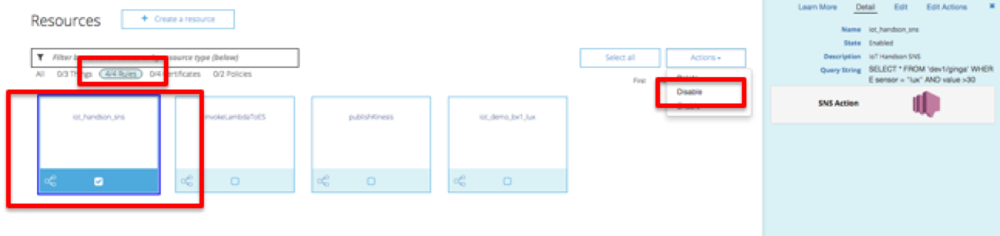

|           

