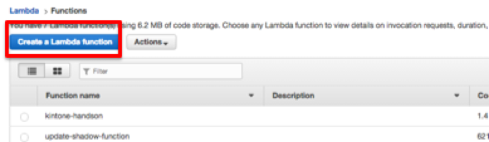
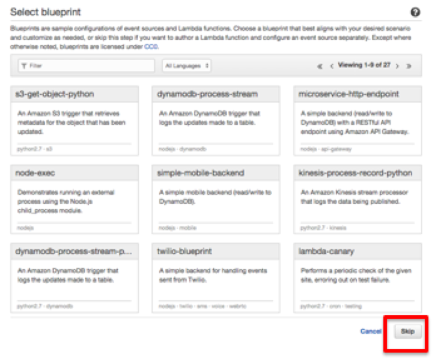
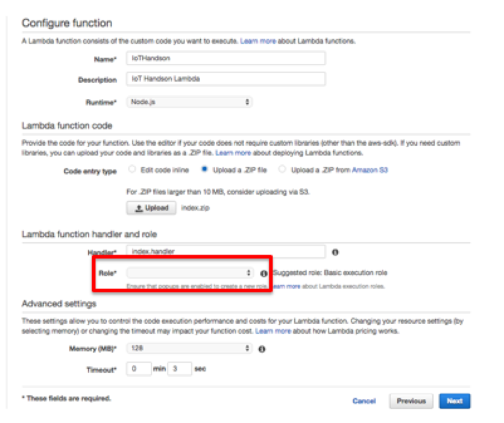
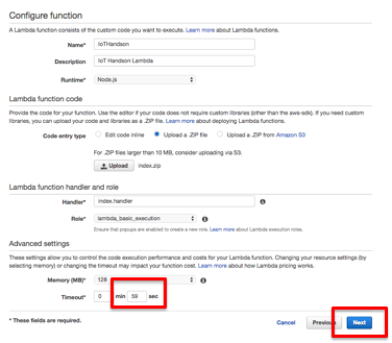
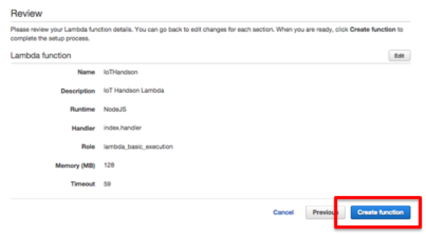
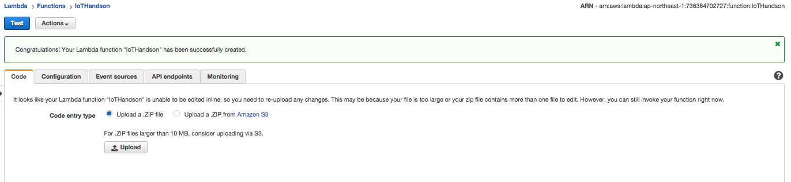
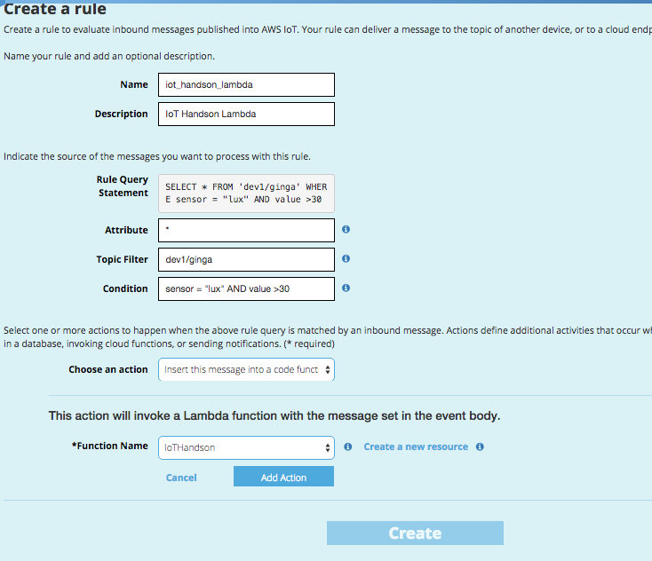

=================
AWS Lambdaの設定
=================

コードの修正
==============
以下のサイトからコードをダウンロードします。

https://github.com/ToshiEna/kintone-aws-iot-handson-2015/raw/master/download/sample.zip

zipをunzipなどで解凍します。
index.jsのノートパッドなどのツールで開きます。

.. code-block:: javascript
  :linenos:   

var moment = require('moment');
var APP_ID = '<<アプリID>>';
var SUBDOMAIN = '<<サブドメイン>>';

exports.handler = function(event, context) {
  var dueDate = moment().add(1, 'd').format('YYYY-MM-DD');
  var acceptNum = moment();
  console.log(dueDate);
  

	record = {
		'受付番号': { value: acceptNum },
		'タイトル': { value: event.title },
		'インシデント': { value: 'アラート' },
		'作業期限': { type: 'DATE', value: dueDate },
		'内容': { value: event.value }
	};

	request({
		method: 'POST',
		url: "https://" + SUBDOMAIN + "/k/v1/record.json",
		headers: {
			'X-Cybozu-Authorization': '<<Auth情報>>',
			'Authorization': 'Basic <<Auth情報>>',
			'Content-Type': 'application/json'
		},
		json: {
			'app': APP_ID,
			'record': record
        }
	}, function(err, response, body) {
		if (err) {
			consle.log("err : " + util.inspect(err));
		}
		if (response.statusCode === 200) {
			console.log('RESULT: ');
			context.succeed();
		} else {
			console.log("response error: " + response.statusCode + ", " + err);
			console.log("response error: " + body.message);
		}
	});
};

アプリIDアプリ、サブドメイン(cybozu.comまで含む)、Auth情報(同一のデータ)を編集して、保存します。

編集後、AWS Lambdaにコードをアップロードするためにサイドzipで圧縮します。

$ zip -r index.zip index.js node_module

AWS Lambdaの設定
==============

AWS Lambdaのコンソールをサービス一覧から選択し、起動します。
改めて東京リージョンであることを確認してください。
"Create a Lambda Function"を選択します。

|           

Select blueprintは、スキップします。

|           

Configure Function画面で名前の入力などを行います。Uploadボタンをクリックし、上記で作成したZipファイルを選択します。
RoleのリストからBasic execution roleを選択します。

|           

ロールを作成する画面に遷移するので、内容を確認して、"許可"ボタンをクリックします。

.. image:: images/6-lambda-create-role.png

|           

画面が元のConfiguration Functionに戻り、Timeoutを59秒にして、"Next"ボタンをクリックします。

|           

確認画面で確認して、"Create Function"をクリックします。

|           

|           

AWS IoTのルール設定
==============

Lambdaの登録が終わったので、先ほどのSNSと同様の手段で、Lambdaを設定します。
手順は、SNSとほぼ同等で、Lambdaを選択する部分のみことなります。

|           

これで準備は整いました。
SNSの時と同様10秒単位でセンサーデータがAWS IoTにPublishされてます。
設定がうまく行っていれば、kintoneの障害対応アプリ内にデータが蓄積されます。

